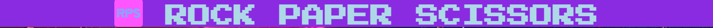
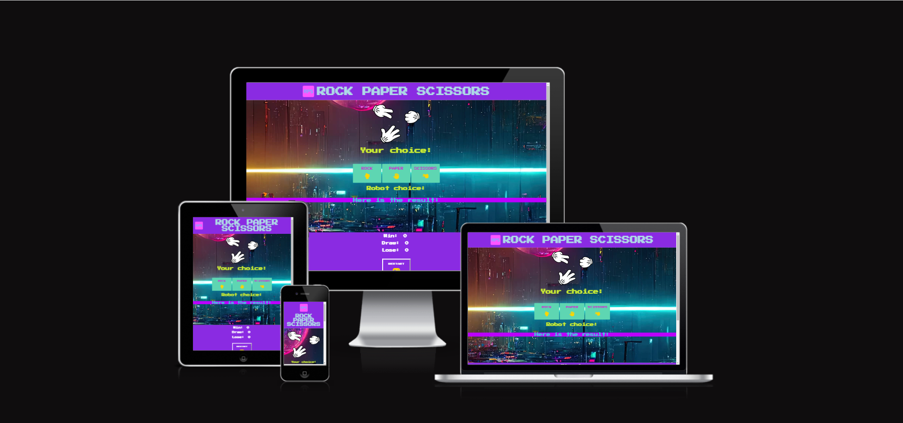
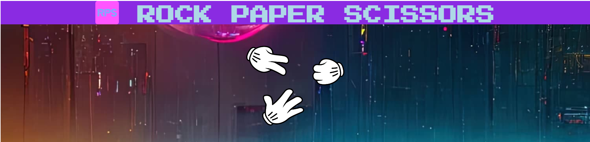
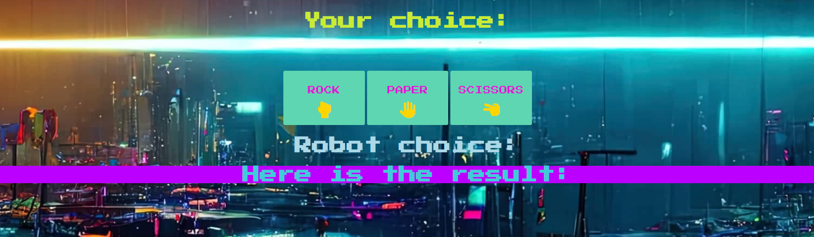
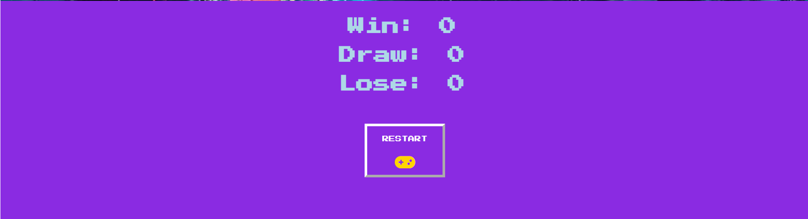
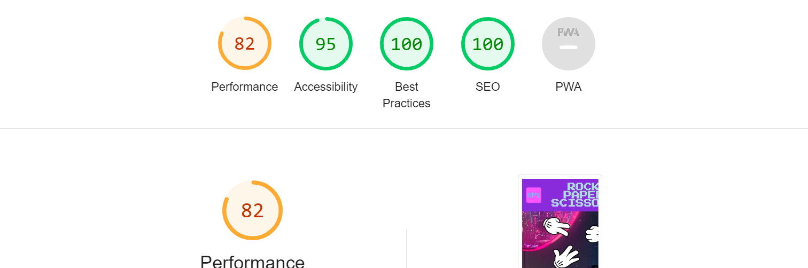

 
 
Paper Scissor Rock Game is a game enable player to play paper scissor rock game with computer robot.

players can play by clicking the button representing paper, scissor, and rock respectively. Player's choice will be printed in the "Your choice" section. Upon clicking, computer will generate a random choice which will be printed in the "robot choice" section.

 

<h1>Features</h1>

<h1>Navigation and The Header</h1>

<ul>
<li>The Logo is located in the middle of the page, using a Press Start 2P font (which assimilates fonts commonly used in computer games) in light blue color and blueviolet background to match the cyberpunk setting of the theme.</li>

<li>There is a photo of paper, scissors and rock below the logo to show that it is a game of paper, scissors and rock</li>

<li>The design of navigation not only present the usage of the game clearly, but it also arouses players' interests to serve and play the game.</li>
</ul>
 

 
<h1>Game area section</h1>

<ul>
<li>The game area section provides three buttons which can be clicked by player to store their choices</li>
<li>The game area has "Your choice" and "Robot choice" to store the choices of player and computer respectively so as to make the process of the game more userfriendly and smooth.</li>
<li>There is a result line underneath the "Robot choice" in order to show the result of the game</li>
<li>The JavaScript function enables the game to store players' choice, generate random number and assign it as computer choice, compare and contrast with the players' choices, and print out the result.</li>
<li>The background photo of the game area is a cyberpunk cityscape photo to match the theme.</li>
<li>The color of the text yellowgreen for "Your Choice", "Robort choice" and result text in order to stand in contrast for player to read easily.</li>
<li>The 3 buttons have clear font awesome icon and text to show paper, scissors and rock respectively.</li>
</ul>
 

 

<h1>Score area and Restart button</h1>

<ul>
<li>The Score area has set three increment function to record the number of player's win, lose and draw.</li>

<li>The Score area background color is blueviolet to echo with that of the header.</li>

<li>The restart button uses the window.location.reload function to refresh the game when player wants to restart the game in order to produce the effect of limited number of play.</li>
<li>A game board font-icon has been added in the restart button to indicate that it is a restart button for navigation and matches the theme of game.</li>
</ul>
 

 

<h1>Testing</h1>

<ul>
<li>I tested that this page works in different browser such as: Chrome, Microsoft-edge, Firefox.</li>
<li>I confirmed the project is responsive, look goods and function on all standard size screen using devtool device tool bar.</li>
</ul>
 
<h1>Bugs</h1>
<h2>Solve bug</h2>
<ul>

<li>I discover that some of my photos cannot be positioned in the center of the page using align items.</li>
<li>After checking in the W3school, I used the display:flex method to avoid adding padding to the image and fix it in the center of page even the media screen size changes.</li>
<li>I also face difficulty in setting up a restart button. After revising the usage of window.location.reload(), I used this in index.html to avoid writing this function in script.js.</li>
<li>After deployed the website, I find that some of the css style is missing. After checking I realised that it is because of adding an extra slash before the a href element.</li>
<li>I also use the gap style to adjust the space between the title and logo in the header part</li>

</ul>

 
<h1>Validation Testing</h1>
<ul>
<li>HTML: No error was found using official W3C Validator.
</li>
<li>CSS: No error was found using official W3C Validator.
</li>
<li>Accesssibility: I confirm colors and fonts chosen are easy to read and accessible by running it through lighthouse in devtools. </li>
</ul>
 

 
<h1>Deployment</h1>

<ul>
The page is deployed to github page, following the below steps.
<li>Navigate to setting in Github page</li>
<li>Select page and select main branch from the dropdown menu</li>
<li>Once the link is deployed, the link is generated in Github page.</li>

</ul>
 
The link is here 

[Rock Paper Scissor Game](https://holaw77.github.io/CI-Portfolio-Project-2-Final-version/)
 
 
<h1>Credit</h1>

<h2>Content</h2>

The Code to make increment function were taken from 

[the CI LoveMath project]("https://github.com/Code-Institute-Solutions/love-maths-2.0-sourcecode/tree/master/05-tidying-up/01-a-few-last-things")

<h2>Media</h2>

<h3>Icons are from font-awesome</h3> 

[https://fontawesome.com/]("https://fontawesome.com/")

<h3>The Lato and Press Start 2P fonts are from Google fonts</h3>

[https://fonts.googleapis.com/css2?family=Lato:wght@300&family=Press+Start+2P&display=swap](https://fonts.googleapis.com/css2?family=Lato:wght@300&family=Press+Start+2P&display=swap)

<h2>Photos reference</h2>

<h3>Index.html</h3>

[https://freesvg.org/rock-paper-scissors]("https://freesvg.org/rock-paper-scissors")

[https://www.google.com/url?sa=i&url=https%3A%2F%2Fpixexid.com%2Fsearch%2Fevent&psig=AOvVaw1iHJ60JOd-mRRjmN1IFCKw&ust=1683532187734000&source=images&cd=vfe&ved=0CBAQjRxqFwoTCNCTwKLc4v4CFQAAAAAdAAAAABAE](https://www.google.com/url?sa=i&url=https%3A%2F%2Fpixexid.com%2Fsearch%2Fevent&psig=AOvVaw1iHJ60JOd-mRRjmN1IFCKw&ust=1683532187734000&source=images&cd=vfe&ved=0CBAQjRxqFwoTCNCTwKLc4v4CFQAAAAAdAAAAABAE)